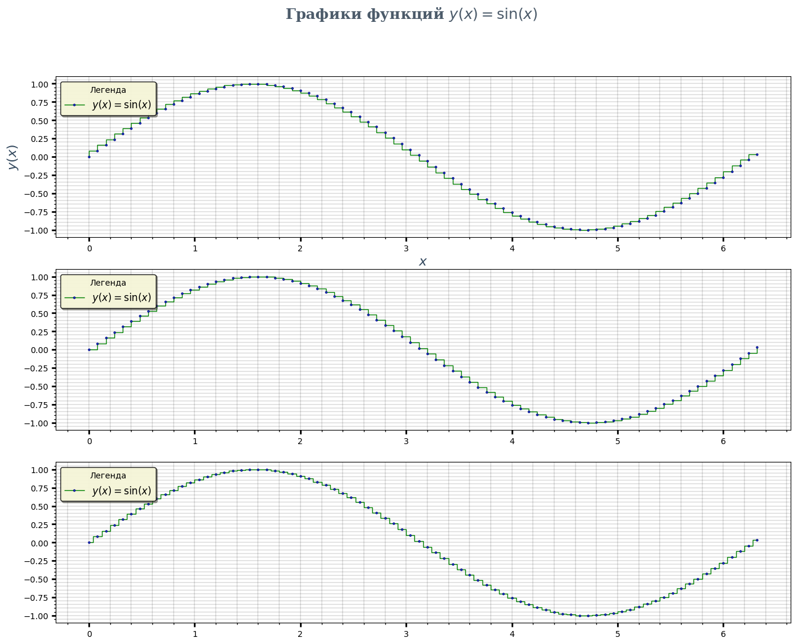
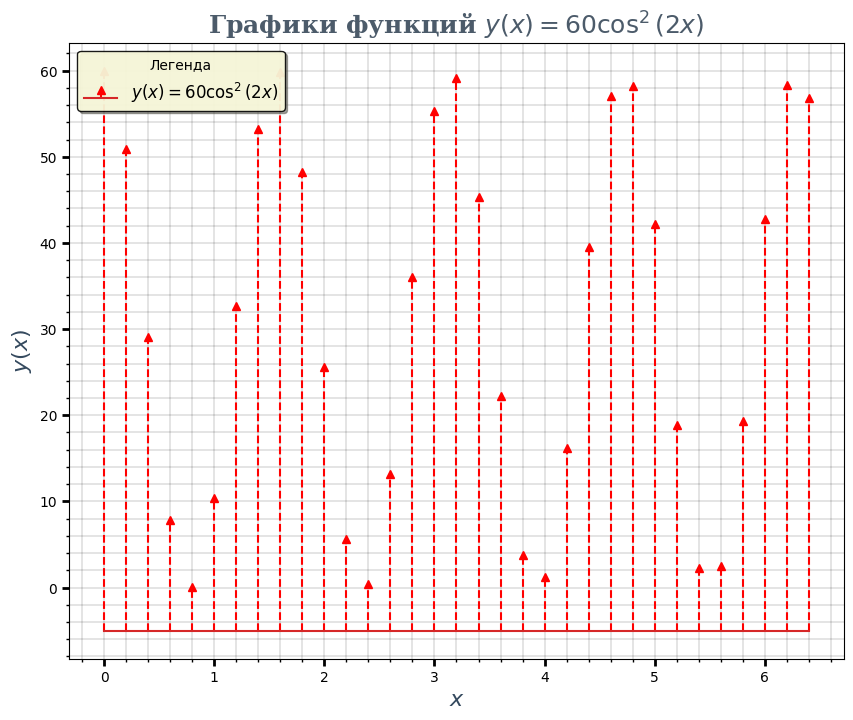
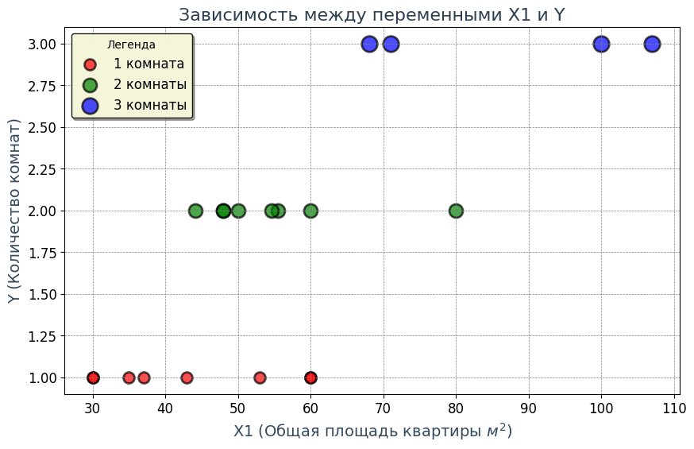
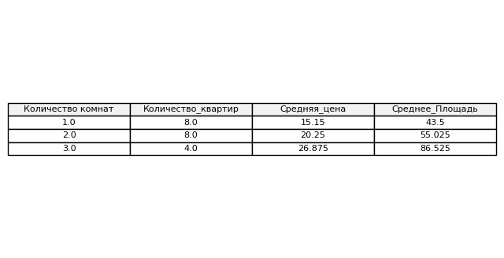
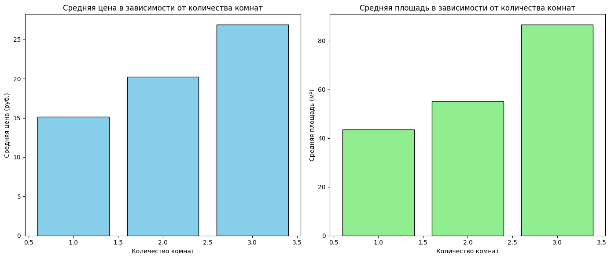
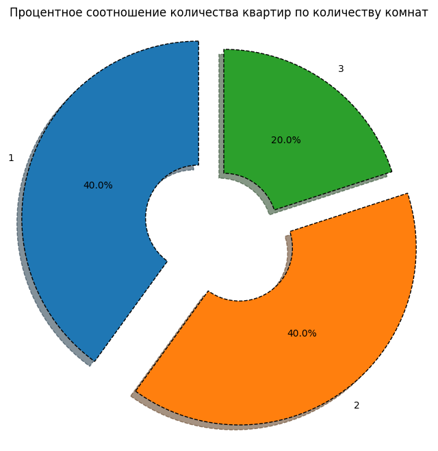

# 📊 FunctionVisualization_Advanced_Matplotlib

Educational project on advanced function and data visualization in Python using Matplotlib and Pandas.  
Учебный проект по продвинутой визуализации функций и данных на Python с использованием Matplotlib и Pandas.

---

## 📌 About / О проекте

🎓 Completed as part of a final self-study assignment on visualization.  
📦 Demonstrates step (stairs) plots, stem plots, scatter plots, bar charts, pie charts, and table rendering.  
💡 Combines function visualization with categorical data analysis and custom styling.

🎓 Выполнено в рамках лабораторной работы по визуализации.  
📦 Показаны ступенчатые графики, stem-графики, диаграммы рассеяния, столбчатые и круговые диаграммы, а также таблицы.  
💡 Совмещает визуализацию функций с анализом категориальных данных и кастомным оформлением.

---

## 📝 Tasks / Задания

### 1. Stairs plot / Ступенчатый график
- Построение `stairs`-графика для функции *y(x)*.  
- Варианты: `where='pre'`, `where='post'`, `where='mid'`.  
- Настройка толщины линии, размера, цвета и контура маркеров.

### 2. Stem plot / Stem-график
- Построение `stem`-графика для функции *y(x)* на интервале `x ∈ [0, 2π]` с шагом `Δx = 0.2`.  
- Индивидуальные настройки линии, маркеров и их стиля.

### 3. Scatter plot / Диаграмма рассеяния
- Визуализация зависимости между двумя переменными.  
- Использование цветов, размеров и легенды для категорий (например, 1, 2, 3 комнаты).  
- Анализ наличия и характера связи.

### 4. Bar chart / Столбчатая диаграмма
- Сравнение средних значений (цены, площади) по категориям.  
- Подписи, цвета, сетка.

### 5. Pie chart / Круговая диаграмма
- Доли категорий (например, квартир по числу комнат).  
- Использование `explode`, процентных подписей и легенды.

### 6. Table rendering / Таблица
- Построение сводной таблицы (`groupby` в Pandas).  
- Отображение таблицы внутри графика с отключёнными осями.

---

## 🔧 Tools & Techniques / Инструменты и приёмы

- **Matplotlib**  
  - `stairs()` — ступенчатые графики  
  - `stem()` — stem-графики  
  - `scatter()` — диаграмма рассеяния  
  - `bar()`, `pie()` — столбчатые и круговые диаграммы  
  - `table()` — отображение таблицы  
  - `legend()`, `grid()`, `tick_params()`, `AutoMinorLocator` — оформление графиков  

- **Pandas**  
  - `DataFrame`, `groupby()`, `agg()` — анализ и агрегация данных  

- **FontProperties** — настройка шрифтов для заголовков и подписей осей  
- Кастомизация цветов, толщины линий, стиля маркеров и прозрачности  

---

## 📁 Structure / Структура

- **MultiDataVisualization_LW4** — основной скрипт с реализацией задания:  
  - Построение stairs-графика  
  - Построение stem-графика  
  - Scatter plot для категориальных данных  
  - Сводная таблица (Pandas)  
  - Bar chart  
  - Pie chart  

---

## 🖼 Screenshots / Скриншоты

*Рис. 1 — stairs-график*

*Рис. 2 — stem-график*

*Рис. 3 — scatter-график*

*Рис. 4 — Таблица данных*  

 
*Рис. 5 — bar-график*

*Рис. 6 — pie-график*  

---
